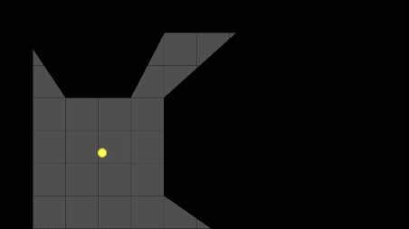

# Outpost 9: Top-Down 2D Game with Dynamic LOS Shadows (Like Nox) (Go/Ebitengine)
A sci-fi rougelike with dynamic LOS shadows similar to the game Nox.

The project is in very early stages, rebuilding from an initial project that was lost to an SSD failure.
Star the project and follow along as the game takes shape!

## Demo

Run: `go run .` (add your tiles to `assets/`)

## Features
- Raycasted shadows for immersive LOS
- Data-driven: Levels/walls/Objects JSON

## Try It
`go get github.com/chosenoffset/outpost9`

